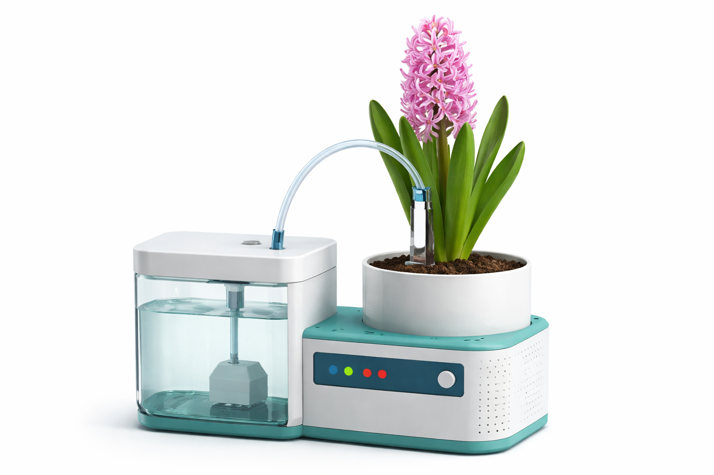
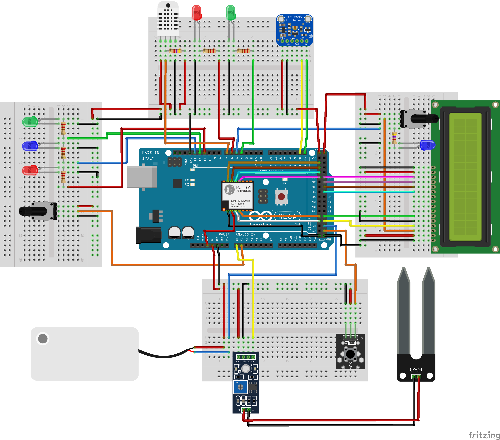
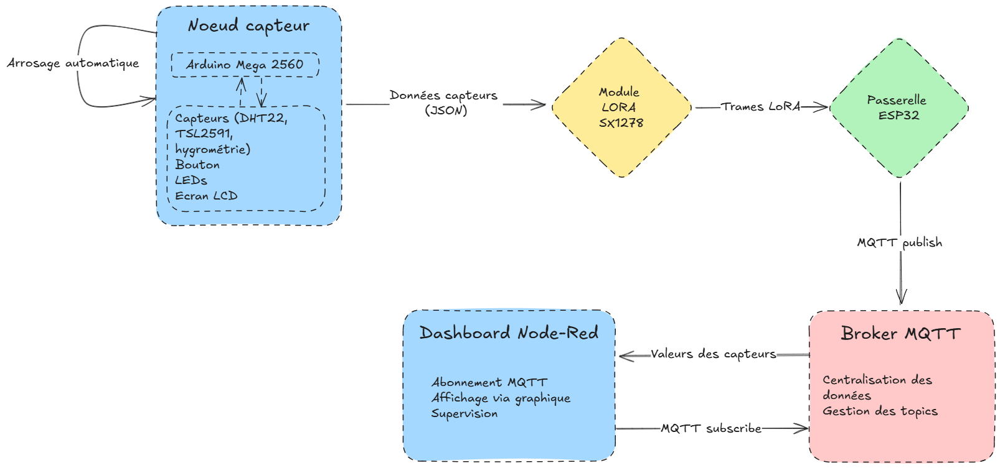
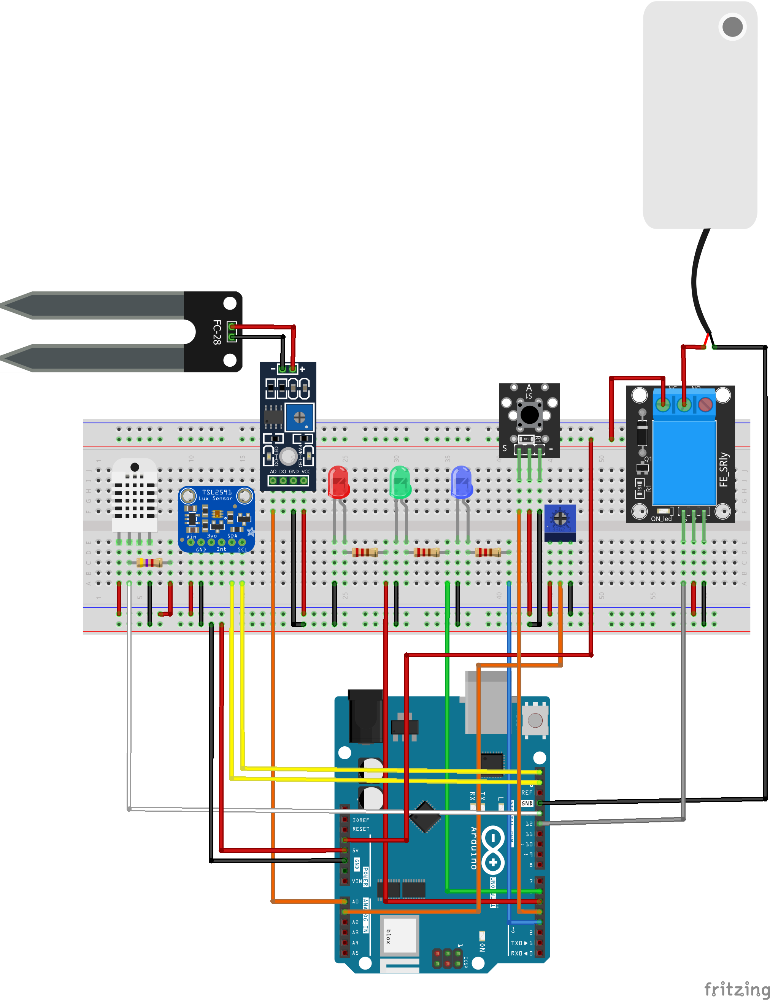
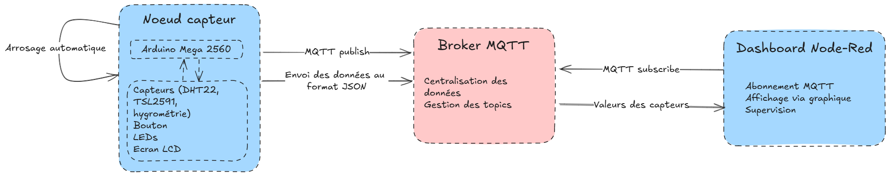
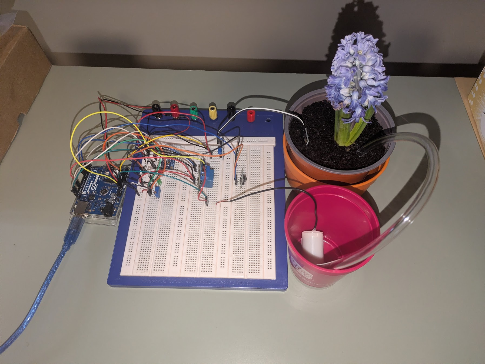
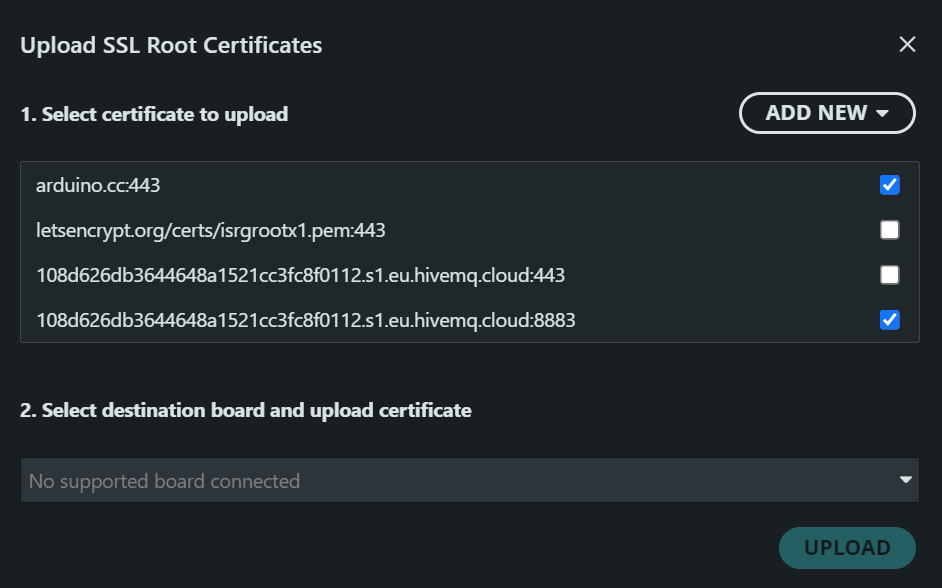
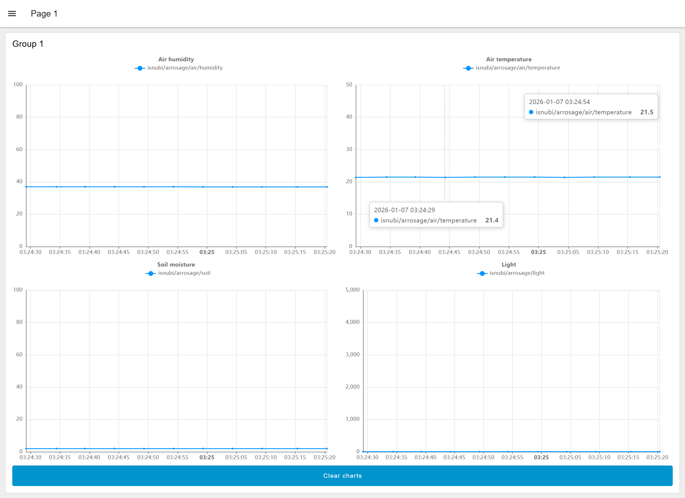

# Rapport de projet - Internet of Things: Concepts and Perspectives in Smart Buildings


<center>*Modèle 3D, généré par ChatGPT, de ce à quoi aurait pu ressembler le projet*</center>

### Auteurs

- Louis GAMBART
- Guillaume MECENE

## Introduction

Dans le cadre de ce projet d'IoT, l'objectiuf était de concevoir un **système de surveillance environnemental** permettant de mésurer différents paramètres physiques (température, humidité, luminosité, humidité du sol), de les transmettre vers un système distant et de les visualiser via un tableau de bord.

Le projet initial prévoyait une **architecture multi-noeuds** intégrant une **communication longue portée** avec le protocole `LoRA`, une passerelle `ESP32` et un affichage local sur un écran LCD. Toutefois, des **contraintes matérielles** rencontrées lors du développement du projet ont mené à des adaptations techniques, tout en essayant de conserver au maximum les **objectifs fonctionnels** du projet.

## Objectifs du projet

### Objectifs fonctionnels

Les objectifs fonctionnels définis dans le cahier des charges étaient les suivants :

- mesurer la température et l'humidité de l'air ;
- mesurer l'humidité du sol ;
- mesurer la luminosité ambiante ;
- transmettre les données vers un serveur distant ;
- visualiser les données sous forme de graphique ;
- permettre le contrôle d'une pompe à eau ;
- assurer une supervision du système.

### Objectifs techniques

- mettre en oeuvre une **architecture IoT complète** ;
- utiliser un **protocole de communication orienté objets** *(eg: `MQTT`)* ;
- structurer les données dans un **format standard** *(eg: `JSON`)* ; 
- garantir une **solution stable et exploitable** dans le temps ;
- fournir un **système fiable et sécurisée**.

## Architecture générale du système

On va maintenant retrouver l'architecture du système IoT en deux temps :

- l'architecture **initialement prévue** dans le cahier des charges ;
- l'architecture **effectivement réalisée** après la prise en compte des contraintes matérielles.

### Vue prévisionnelle


<center>*Schéma de l'architecture initialement prévue*</center>

L'architecture définie dans le cahier des charges reposait sur une **chaîne IOT multi-noeuds**, visant à séparer l'acquisition des données, de sa transmission via `MQTT`.

Elle était composée des éléments suivants :

- un **Arduino Mega 2560**, jouant le rôle de **noeud capteur**, chargé de :
  - lire les capteurs environnementaux,
  - gérer les LEDs, le bouton utilisateur et l'écran LCD,
  - formater les données sous forme de trames `JSON` ;
- un **module `LoRA SX1278`**, connecté à l'Arduino, assurant une **communication longue portée** ;
- une **passerelle `ESP32`**, chargée de :
  - recevoir les trames `LoRA`,
  - vérifier leur validité,
  - transmettre les données via `WiFi` vers un broker `MQTT` ;
- un **broker `MQTT`**, centralisant les données ;
- un **dashboard `Node-Red`**, permettant la visualisation et la supervision du système.

Cette architecture modulaire permettait :

- une séparation claire des responsabilités,
- une meilleure évolutivité,
- la possibilté de déployer des capteurs loin d'un réseau WiFi.


<center>*Diagramme de flux initialement prévu*</center>

### Vue finale

Suite aux contraintes matérielles rencontrées qui seront présentées plus tard, l'architecure a été **simplifiée** afin de garantir un système **fonctionnel et stable**.


<center>*Schéma de l'architecture réalisée*</center>

L'architecture finale respose sur les éléments suivants :

- un **Arduino Uni WiFi Rev2**, assurant à lui seul :
  - la lecture de l'ensemble des capteurs,
  - la gestion de la pompe à eau via un relais,
  - la gestion des LEDs et du bouton utilisateur,
  - la publication directe des données vers un broker `MQTT` ;
- un **broker `MQTT` HiveMQ privé**, protégé par authentification ;
- un **dashboard `Node-Red`**, chargé de :
  - souscrie aux topics `MQTT`,
  - stocker et afficher les données,
  - produire des graphiques temporels.

Dans cette version, l'Arduino communique **directement en `WiFi` avec le broker `MQTT`, supprimant ainsi les couches `LoRA` et `ESP32` initialement prévues.

Les données sont envoyées de manière **périodique** sous forme de messages `MQTT`, puis exploitées par `Node-Red` pour assurer la visualisation et la supervision du système.


<center>*Diagramme de flux réalisé*</center>

## Matériel utilisé

### Liste des composants

| Composant | Rôle |
|-----------|------|
|Arduino Uno WiFi Rev2|Unité centrale|
|DHT22|Capteur de température et d'humidité de l'air|
|TSL2591|Capteur de luminosité|
|Capteur hygrométrique|Capteur d'humidité du sol|
|Potentiomètre|Réglagle de l'intensité des LEDs|
|Relais|Commande électrique de la pompe|
|Bouton poussoir|Activation manuelle de la pompe|


<center>*Photographie du montage réalisé*</center>

## Budget du projet

L'un des points positifs du projet est son faible coût de réalisation. En effet, la majorité des composants étaient **déjà disponibles**, et les composants achetés sont peu onéreux.

Nous avions, notamment, déjà en notre possession :

- l'Arduino Uni WiFi Rev2 ;
- le capteur DHT22 et le capteur TSL2591 ;
- le module relais, les LEDs et le bouton poussoir ;
- les câbles, résistances et breadboard.

Seuls quelques composants ont été acquis pour la réalisation du projet, pour un coût total de **24,47 €**.

### Dépenses engagées

| Composant | Prix unitaire | Quantité | Coût total |
|-----------|---------------|----------|------------|
|Capteur hygrométrique|7,99 €|1|7,99 €|
|Potentiomètre 10k$\Omega$|0,37 €|20|7,49 €|
|Pompe à eau submersible|3 €|3|8,99 €|
|**Total**| | |**24,47 €**|

### Analyse du coût

Le coût total du projet reste donc **très abordable** pour un système IoT complet intégrant :

- plusieurs capteurs environnementaux ;
- une commande d'actionneur ;
- une communication sans fil ;
- une visualisation des données via un dashboard.

Cela met en évidence une volonté de concevoir des solutions IoT **accessibles** et **économiques**, grâce à :

- la **réutilisation de matériel existant** ;
- le choix de **composants peu coûteux** ;
- l'utilisation de **technologies open-source** pour le développement logiciel.

## Implémentation technique

### Organisation logicielle

Le programme Arduino repose sur :

- des boucles principales non bloquantes, permettant une lecture périodique des capteurs et un envoi régulier des données *(eg: `millis()`)*,
- des fonctions dédiées aux tâches spécifiques,
- une gestion simple des états,
- une publication `MQTT` périodique.

Les données sont encapsulées au format `JSON` pour une meilleure structuration et lisibilité avant la publication.

L'ensemble du code peut-être trouvé [ici](https://github.com/isnubi/projet-iot).

#### Extrait de code - Connexion MQTT sécurisée

```cpp
#include <WiFiNINA.h>
#include <ArduinoMqttClient.h>

WiFiSSLClient wifiClient;
MqttClient mqttClient(wifiClient);

const char broker[] = "<private_id>.s1.eu.hivemq.cloud";
int port = 8883;

char mqttUser[] = "username";
char mqttPass[] = "MyHardPassword1*";

unsigned long lastMqttSend = 0;

void connectMQTT() {
  Serial.print("Connexion MQTT...");
  mqttClient.setUsernamePassword(mqttUser, mqttPass);
  while (!mqttClient.connect(broker, port)) {
    Serial.print("Erreur MQTT: ");
    Serial.println(mqttClient.connectError());
    delay(2000);
  }
  Serial.println("\nMQTT connecté");
}

void sendMQTT(float humAir, float tempAir, float humSol, float lux, bool pompeState) {
  if (serialEnabled == true) {
    Serial.println("Envoi MQTT...");
  }
  mqttClient.beginMessage("louisg/arrosage/air/humidity");
  mqttClient.print(humAir);
  mqttClient.endMessage();

  mqttClient.beginMessage("louisg/arrosage/air/temperature");
  mqttClient.print(tempAir);
  mqttClient.endMessage();

  mqttClient.beginMessage("louisg/arrosage/soil");
  mqttClient.print(humSol);
  mqttClient.endMessage();

  mqttClient.beginMessage("louisg/arrosage/light");
  mqttClient.print(lux);
  mqttClient.endMessage();

  // JSON global
  mqttClient.beginMessage("louisg/arrosage/status");
  mqttClient.print("{");
  mqttClient.print("\"temp\":");
  mqttClient.print(tempAir);
  mqttClient.print(",");
  mqttClient.print("\"humAir\":");
  mqttClient.print(humAir);
  mqttClient.print(",");
  mqttClient.print("\"humSol\":");
  mqttClient.print(humSol);
  mqttClient.print(",");
  mqttClient.print("\"lux\":");
  mqttClient.print(lux);
  mqttClient.print("\"}");
  mqttClient.endMessage();
}
```

Ici, l'usage du `WiFiSSLClient` permet d'assurer l'établissement d'une connexion sécurisée au broker `MQTT` via `TLS`, ce qui est requis par HiveMQ.

#### Difficultés avec les certificats

```cpp
12:21:32.818 -> TSL2591 OK
12:21:32.818 -> Connexion WiFi....
12:21:37.005 -> WiFi connecté
12:21:37.036 -> IP : 192.168.129.83
12:21:37.081 -> Connexion MQTT...Erreur MQTT: -2
```

Nous avons eu des difficultés à faire fonctionner la connexion sécurisée avec HiveMQ, en raison de problèmes liés aux certificats `TLS`.

En effet, la librairie `WiFiNINA` utilisée par l'Arduino Uni WiFi Rev2 ne permet pas de charger des certificats personnalisés, ce qui complique la validation de la connexion sécurisée.

Nous avons, difficilement, car peu documenté, finalement réussi à modifier le firmware de la carte pour intégrer les certificats nécessaires, permettant ainsi d'établir une connexion `TLS` fonctionnelle avec le broker `MQTT`.

En se rendant dans `Tools > Upload SSL Root Certificates`, nous avons pu ajouter le certificat racine de notre instance HiveMQ pour ensuite l'uploader sur la carte.


<center>*Capture d'écran de l'upload des certificats SSL dans l'IDE Arduino*</center>

Une fois le problème résolu, la connexion au broker s'est effectuée sans erreur.

```cpp
12:22:08.660 -> TSL2591 OK
12:22:08.660 -> Connexion WiFi....
12:22:12.885 -> WiFi connecté
12:22:12.916 -> IP : 192.168.129.83
12:22:12.916 -> Connexion MQTT...
12:22:14.501 -> MQTT connecté
12:22:14.501 -> === SYSTEME ARROSAGE UNO PRET ===
12:22:14.534 -> Commandes : POMPE ON | POMPE OFF | STATUS
12:22:14.770 -> Envoi MQTT...
12:22:14.770 -> Air H: 36.20% | T: 21.80C | Sol: 2% (1014) | Lux: 33.24
```

### Protocoles et technologies utilisés

- **`WiFi`** : sert à la communication sans-fil entre l'Arduino et le broker `MQTT`.
- **`MQTT`** : protocole de messagerie léger, adapté aux environnements IoT, utilisé pour la transmission des données.
- **`JSON`** : format de données structuré, facilitant l'organisation et l'interprétation des informations échangées.
- **`Node-Red`** : plateforme de développement visuel utilisée pour créer le dashboard de visualisation des données.

Ces choix sont cohérents avec les objectifs du projet, visant à garantir une solution **fiable**, **évolutive** et **facile à maintenir**.

## Dashboard Node-Red


<center>*Capture d'écran du dashboard Node-Red*</center>

Le dashboard `Node-Red` permet :

- l'affichage en temps réel des données mesurées ;
- l'historisation des mesures ;
- la visualisation graphique des tendances ;
- la supervision du système via des alertes.


<center>*Flux Node-Red utilisé pour le dashboard*</center>

## Ecarts par rapport au cahier des charges

### Arduino Mega 2560

L'Arduino Mega initialement prévue est devenue inutilisable (problèmes de communication avec l'IDE).

Nous avons donc réagit rapidement en le remplacant par une carte que nous possédions déjà : l'Arduino Uno WiFi Rev2. Cette carte intègre une connectivité `WiFi` native, ce qui a permis de simplifier l'architecture du système par la suite.

### Communication LoRA

L'utilisation du module `LoRA SX1278` a posé plusieurs problèmes lors de son intégration. En effet, malgré de nombreux essais, nous n'arrivions pas à faire démarrer ou à établir une communication stable entre le module `LoRA` et l'Arduino Mega.

Après plusieurs recherches, nous avons découvert que le module `LoRA` nécessite une alimentation avec une intensité beaucoup plus importante que ce que l'Arduino peut fournir via ses broches `5V` ou `3.3V`. Faute de matériel adéquat pour alimenter correctement le module, nous avons dû abandonner cette partie du projet.

Cela nous a donc conduit à simplifier l'architecture, retirant par ailleurs la couche de sécurité prévue par la passerelle `ESP32`, avec notamment l'anti rejeu des messages par exemple.

### Suppresion de l'ESP32

L'abandon de la communication `LoRA` a rendu l'`ESP32` inutile dans l'architecture du système. En effet, sans réception de données via `LoRA`, la passerelle ne pouvait plus remplir son rôle de relais entre les capteurs et le broker `MQTT`. Nous avons donc décidé de supprimer cette couche intermédiaire, simplifiant ainsi la communication directe entre l'Arduino Uni WiFi Rev2 et le broker `MQTT`.

### Suppression de l'écran LCD

L'écran LCD, initialement prévu pour afficher localement les données mesurées, a également été supprimé du projet pour une raison de **contraintes matérielles**. En effet, l'Arduino Uni WiFi Rev2 dispose de ressources limitées en termes de broches, nous empêchant de connecter tous les capteurs et actionneurs nécessaires en même temps.

Nous avons donc préférer privilégier les capteurs et actionneurs au détriment de l'affichage local, en nous reposant sur le dashboard `Node-Red` pour la visualisation des données.

## Analyse critique du projet

Ce projet nous a permis de mettre en pratique les principaux concepts d'un système IoT, depuis l'acquisition de données physiques, jusqu'à leur visualisation sur un tableau de bord. Il met cependant en évidence plusieurs éléments d'attention importants liés aux contraintes matérielles et aux choix technologiques.

L'architecture initiale, plus complète, prévoyait l'utilisation d'une communication longue portée avec `LoRA`, d'une passerelle `ESP32` et d'un affichage local sur un écran LCD.
Les contraintes rencontrées lors de l'implémentation ont conduit à une simplification de l'architecture.
Cette adaptation a permis de garantir un **système fonctionnel et stable**, mais au prix de certaines fonctionnalités initiales, et d'une abstraction d'une couche de sécurité.

D'un point de vue technique, la suppression des couches intermédiaires a eu un impact positif sur la **simplicité** et la **fiabilité** du système. En effet, l'architecture finale est plus simple, plus facile à déboguer et mieux maîtrisée.
En revance, elle limite la portée du système et le rend dépendant d'une connexion `WiFi` stable.

Ce projet a également mis en lumière l'importance de **l'anticipation des besoins matériels**, notamment en termes d'alimentation, dès la phase de conception. Ces aspects essentiels dans un vrai projet IoT, où les contraintes physiques ont un impact direct sur les choix d'architecture.

Malgré ces limitations, les principaux objectifs ont pu être atteints, et le projet constitue une base solide pour des améliorations futures.

## Ce qui peut être amélioré

Plusieurs pistes d'amélioration peuvent être envisagées pour faire évoluer le projet vers une solution plus complète et robuste :

- **Communication**
  - Réintégrer la communication `LoRA` avec une alimentation adaptée ;
  - ajout d'une redondance de communication *(eg: fallback `WiFi`/`LoRA`)*.
- **Sécurité**
  - Gestion plus fine des droits d'accès au broket ;
  - ajout de mécanismes d'authentification renforcée ;
  - système anti-rejeu des messages MQTT.
- **Stockage et analyse des données**
  - Intégration d'une base de données pour l'historisation des mesures *(eg: `InfluxDB`)* ;
  - analyse des tendances à long terme *(eg: mini modèles de machine learning)* ;
  - détection automatique d'anomalies.
- **Interface utilisateur**
  - Ajout d'une écran `LCD`/`OLED` pour l'affichage local des données via bus `I²C` ;
  - création d'une application mobile ou d'une interface web dédiée.
- **Autonomie énergétique**
  - Alimentation par batterie rechargeable ;
  - ajout d'un panneau solaire pour un fonctionnement autonome.
- **Intégration mécanique**
  - Conception et impression 3D d'un boitier ;
  - intégration d'un réservoire d'eau et d'un support de plante ;
  - meilleure protection de l'électronique contre l'humidité.

Ces améliorations permettraient de renforcer la robustesse, la sécurité et l'utilisabilité du système.

## Conclusion

Ce projet IoT a permis de concevoir et de mettre en oeuvre un système de surveillance environnemental complet, intégrant capteurs, actionneurs, communication réseau et visualisation des données. Malgré les contraites matérielles rencontrées, nous avons su adapter l'architecture initiale pour garantir un système fonctionnel et stable.

Les adaptations réalisées au cours du projet mettent en lumière l'importance de la flexibilité et de l'anticipation des besoins matériels dans la conception d'un système IoT. Elles soulignent également les compromis parfois nécessaires entre fonctionnalités, complexité et fiabilité.

Le projet met en évidence l'importance de la simplicité, de la robustesse et de la maîtrise des technologies utilisées dans le développement d'une solution IoT. Il constitue une base solide pour des évolutions futures, visant à renforcer la sécurité, l'autonomie et l'expérience utilisateur.